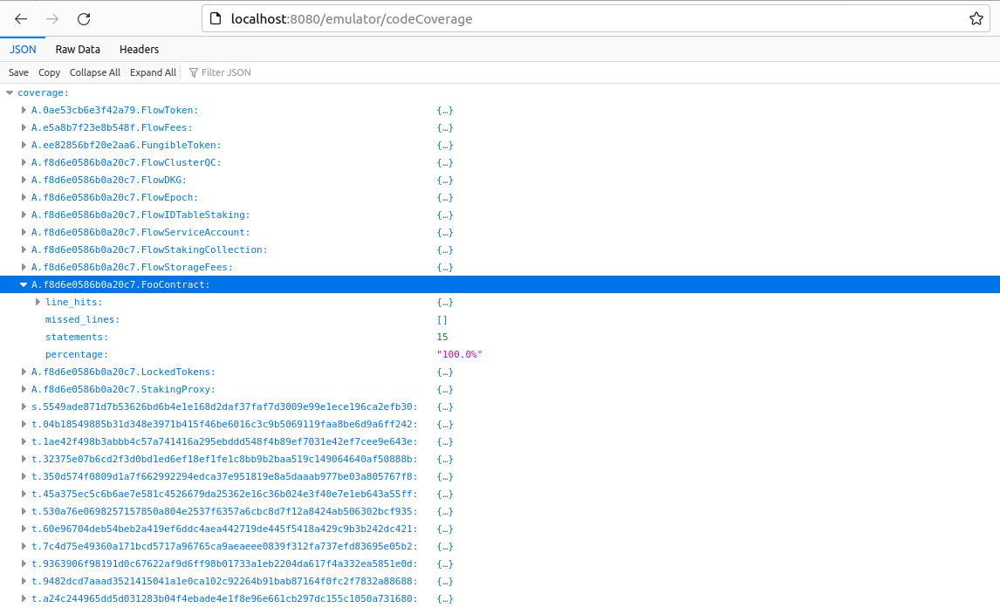
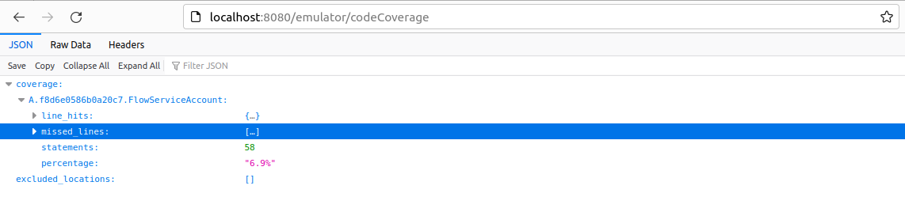

# Cadence Testing Framework & Code Coverage

## Requirements

Make sure that you have installed the minimum required version of `flow-cli`:

```bash
flow version

Version: v1.0.2
Commit: 5b6d176eec1c6248968f17ef4126327db2788103
```

To install it, simply run:

```bash
sh -ci "$(curl -fsSL https://raw.githubusercontent.com/onflow/flow-cli/master/install.sh)" -- v1.0.2
```

## For Testing

To view code coverage results when running our tests, we can use:

```bash
flow test --cover tests/test_foo_contract.cdc
```

The output will look something like this:

```bash
Test results: "tests/test_foo_contract.cdc"
- PASS: testGetIntegerTrait
- PASS: testAddSpecialNumber
Coverage: 93.3% of statements
```

It looks like not all statements were covered by the test inputs. To view details for the coverage report,
we can consult the auto-generated `coverage.json` file:

```json
{
  "coverage": {
    "S.../contracts/FooContract.cdc": {
      "line_hits": {
        "14": 1,
        "18": 9,
        "19": 1,
        "20": 8,
        "21": 1,
        "22": 7,
        "23": 1,
        "24": 6,
        "25": 1,
        "26": 5,
        "27": 0,
        "30": 5,
        "31": 4,
        "34": 1,
        "6": 1
      },
      "missed_lines": [
        27
      ],
      "statements": 15,
      "percentage": "93.3%"
    }
  },
  "excluded_locations": [
    "s.7465737400000000000000000000000000000000000000000000000000000000",
    "I.Crypto",
    "I.Test"
  ]
}
```

Note: We can use the `--coverprofile` flag if we wish to generate the coverage report to a different file.

```bash
flow test --cover --coverprofile=codecov.json tests/test_foo_contract.cdc
```

Reading the JSON file, we can see that for `FooContract` the line `27` was missed during the tests (not covered by the test inputs).

To fix that, we can tweak the `testInputs` Dictionary on `tests/test_foo_contract.cdc` to observe how the coverage percentage changes. By uncommenting the line `13`, we now get:

```bash
flow test --cover tests/test_foo_contract.cdc

Test results: "tests/test_foo_contract.cdc"
- PASS: testGetIntegerTrait
- PASS: testAddSpecialNumber
Coverage: 100.0% of statements
```

For some more realistic contracts and tests:

```bash
flow test --cover tests/test_array_utils.cdc

Test results: "tests/test_array_utils.cdc"
- PASS: testRange
- PASS: testTransform
- PASS: testIterate
- PASS: testMap
- PASS: testMapStrings
- PASS: testReduce
Coverage: 90.6% of statements
```

Look at the files `contracts/ArrayUtils.cdc` (smart contract) and `tests/test_array_utils.cdc` (tests for the smart contract).
For the `ArrayUtils.range` method, we have omitted the code branch where `start > end` on purpose. It is left as an exercise for the reader. Look at the comment on line 25 in `tests/test_array_utils.cdc`.

Note that the above examples of tests could be best described as unit tests.

An example of integration tests can be found in the `tests/test_string_utils.cdc` file, which tests the functionality of the `contracts/StringUtils.cdc` smart contract.

```bash
flow test --cover tests/test_string_utils.cdc

Test results: "tests/test_string_utils.cdc"
- PASS: testFormat
- PASS: testExplode
- PASS: testTrimLeft
- PASS: testTrim
- PASS: testReplaceAll
- PASS: testHasPrefix
- PASS: testHasSuffix
- PASS: testIndex
- PASS: testCount
- PASS: testContains
- PASS: testSubstringUntil
- PASS: testSplit
- PASS: testJoin
Coverage: 54.5% of statements
```

The generated `coverage.json` file is somewhat more elaborate, for integration tests. By viewing its content, we find the following keys:

- `A.01cf0e2f2f715450.ArrayUtils`
- `A.01cf0e2f2f715450.StringUtils`
- `A.0ae53cb6e3f42a79.FlowToken`
- `A.e5a8b7f23e8b548f.FlowFees`
- `A.ee82856bf20e2aa6.FungibleToken`
- `A.f8d6e0586b0a20c7.FlowServiceAccount`

and some other locations.

Locations that start with `A.` are contracts deployed to an account, ones that start with `s.` are scripts, and ones that start with `t.` are transactions.

The `ArrayUtils` smart contract is imported by `StringUtils`, that's why it was deployed on the integration tests, and that's why it is included in the resulting coverage report.

For viewing the coverage report of the `StringUtils` smart contract, we can just consult the value of the `A.01cf0e2f2f715450.StringUtils` key, in the `coverage.json` file.

The rest of the keys are system contracts that are always available in the Flow Emulator, which is utilized as the backend implementation for integration tests.

There is also a more advance example of integration tests for the `ApprovalVoting` smart contract, which deals with resources, multi-sig transactions etc.

```bash
flow test --cover tests/test_approval_voting.cdc

Test results: "tests/test_approval_voting.cdc"
- PASS: testInitializeEmptyProposals
- PASS: testInitializeProposals
- PASS: testProposalsImmutability
- PASS: testIssueBallot
- PASS: testCastVoteOnMissingProposal
- PASS: testCastVote
- PASS: testViewVotes
Coverage: 45.5% of statements
```

## For Emulator

It is also possible to view code coverage through the emulator, outside the context of testing.

All we have to do is start the emulator with the necessary flag (`coverage-reporting`):

```bash
flow emulator --storage-limit=false --coverage-reporting
```

With this, we can use our browser and visit http://localhost:8080/emulator/codeCoverage.

This code coverage report will reflect every interaction with the emulator. For example, we can deploy contracts to the emulator, run scripts/transactions against them and view the results:

```bash
flow deploy contracts --network=emulator

flow scripts execute scripts/foo_contract_scripts.cdc --network=emulator
```



We can also flush/reset the collected code coverage report, with:

```bash
curl -XPUT 'http://localhost:8080/emulator/codeCoverage/reset'
```

Which results in the following:



All of the keys have disappeared, except for `A.f8d6e0586b0a20c7.FlowServiceAccount`, which is a system contract that is essential to the operations of Flow.
